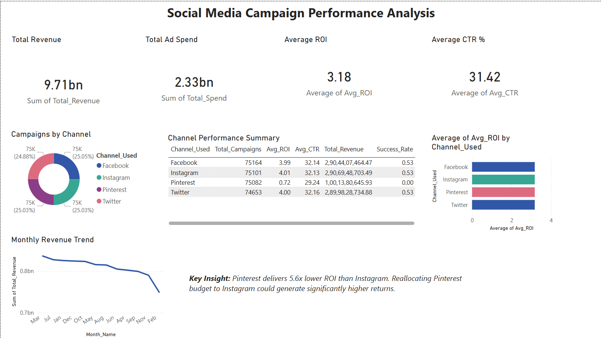
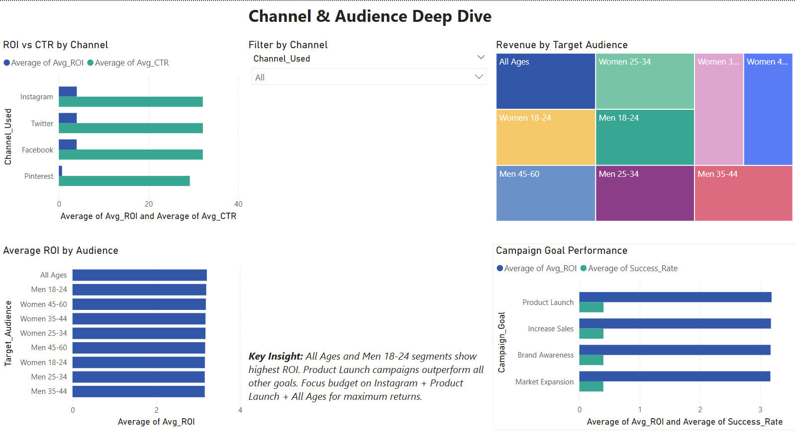
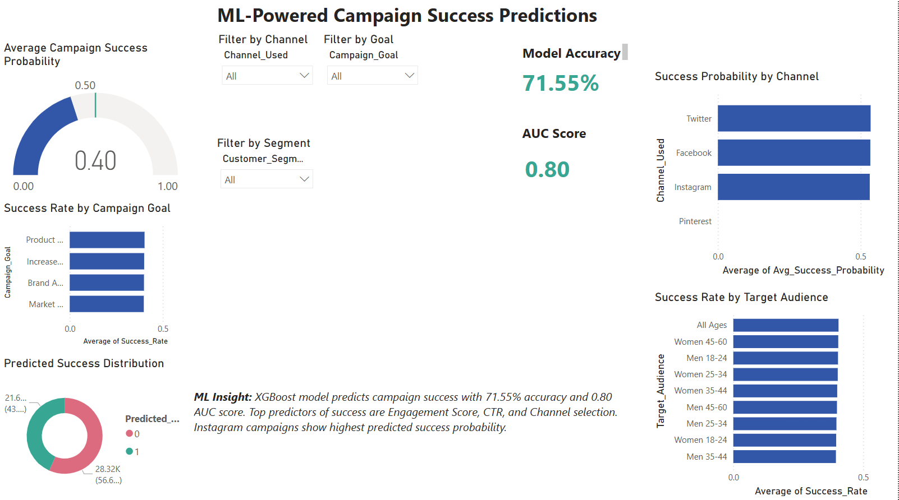

# 📊 Social Media Campaign Performance & ROI Analysis


## 🎯 Project Overview
An end-to-end data science project analyzing **300,000+ social media ad campaigns** across Instagram, Facebook, Twitter, and Pinterest. The project identifies ROI drivers, audience insights, and predicts campaign success using Machine Learning.

**Key Finding:** Pinterest delivers **5.6x lower ROI** than Instagram. Reallocating budget to Instagram could unlock significantly higher returns.

---

## 📌 Business Problem
A brand runs paid campaigns across multiple social media platforms but doesn't know:
- Which platform gives the best ROI?
- Which audience segment converts most?
- Which campaign type is most successful?
- Can we predict if a campaign will succeed before spending budget?

---

## 🔍 Key Insights

| Insight | Finding |
|---|---|
| Best Channel | Instagram (ROI: 4.01) |
| Worst Channel | Pinterest (ROI: 0.72) |
| Best Campaign Goal | Product Launch |
| Best Audience | All Ages segment |
| Best Month | April |
| Best Day | Friday |
| Total Revenue Analyzed | $9.71 Billion |
| Total Ad Spend Analyzed | $2.33 Billion |
| Overall Average ROI | 3.18x |

---

## 🤖 Machine Learning Results

| Model | Accuracy | AUC Score |
|---|---|---|
| Logistic Regression | ~58% | ~0.65 |
| Random Forest | ~69% | ~0.77 |
| **XGBoost** | **71.55%** | **0.80** |

**XGBoost** was the best performing model with:
- 71.55% Accuracy
- 0.80 AUC Score
- Trained on 240,000 samples
- Tested on 60,000 samples

---

## 📊 Dashboard Preview

### Page 1 — Campaign Overview


### Page 2 — Channel & Audience Analysis


### Page 3 — ML Predictions


---

## 🛠️ Tech Stack

| Tool | Usage |
|---|---|
| Python | Data cleaning, EDA, ML |
| Pandas & NumPy | Data manipulation |
| Matplotlib & Seaborn | Data visualization |
| Scikit-learn | ML models |
| XGBoost | Best ML model |
| Power BI | Interactive dashboard |
| Jupyter Notebook | Development environment |

---

## 📁 Project Structure

```
social-media-campaign-analysis/
|
|-- data/
|   |-- Social_Media_Advertising.csv
|   |-- cleaned_campaign_data.csv
|
|-- notebooks/
|   |-- data_loading_and_exploration.ipynb
|   |-- EDA_Analysis.ipynb
|   |-- ML_Model.ipynb
|
|-- models/
|   |-- xgb_campaign_model.pkl
|   |-- label_encoders.pkl
|
|-- dashboard/
|   |-- Social_Media_Campaign_Analysis.pbix
|   |-- Social_Media_Campaign_Analysis.pdf
|
|-- images/
|   |-- channel_performance.png
|   |-- campaign_goal_analysis.png
|   |-- roi_distribution.png
|   |-- location_analysis.png
|   |-- time_analysis.png
|   |-- model_evaluation.png
|   |-- feature_importance.png
|   |-- dashboard_page1.png
|   |-- dashboard_page2.png
|   |-- dashboard_page3.png
|
|-- powerbi_exports/
|   |-- powerbi_channel_summary.csv
|   |-- powerbi_monthly_summary.csv
|   |-- powerbi_audience_summary.csv
|   |-- powerbi_goal_summary.csv
|   |-- powerbi_main_data.csv
|
|-- README.md
```

---

## 🚀 How to Run

**1. Clone the repository:**
```bash
git clone https://github.com/Lovepreet1121/social-media-campaign-analysis.git
cd social-media-campaign-analysis
```

**2. Install dependencies:**
```bash
pip install pandas numpy matplotlib seaborn scikit-learn xgboost jupyter
```

**3. Download dataset:**
- Get dataset from [Kaggle](https://www.kaggle.com/datasets/jsonk11/social-media-advertising-dataset)
- Place in `data/` folder

**4. Run notebooks in order:**
```
1. data_loading_and_exploration.ipynb
2. EDA_Analysis.ipynb
3. ML_Model.ipynb
```

**5. Open Power BI Dashboard:**
- Open `dashboard/Social_Media_Campaign_Analysis.pbix`

---

## 💡 Business Recommendations

1. **Reallocate Pinterest budget** to Instagram for 5.6x better ROI
2. **Focus on Product Launch campaigns** for highest success rate
3. **Target All Ages segment** for consistently highest ROI
4. **Run campaigns in April** for best monthly performance
5. **Schedule campaigns on Fridays** for best engagement
6. **Use ML predictions** to pre-screen campaigns before spending budget

---

## 📈 Project Highlights

- ✅ End-to-end data pipeline (300,000+ records)
- ✅ Advanced EDA and business insights
- ✅ Machine Learning with 71.55% accuracy and 0.80 AUC
- ✅ Interactive 3-page Power BI dashboard
- ✅ Real business recommendations with dollar impact

---

## 👤 Author

**Lovepreet**
- GitHub: [github.com/Lovepreet1121](https://github.com/Lovepreet1121)
- LinkedIn: [linkedin.com/in/love-preet-/](https://linkedin.com/in/love-preet-/)
- Email: lp5120452@gmail.com
